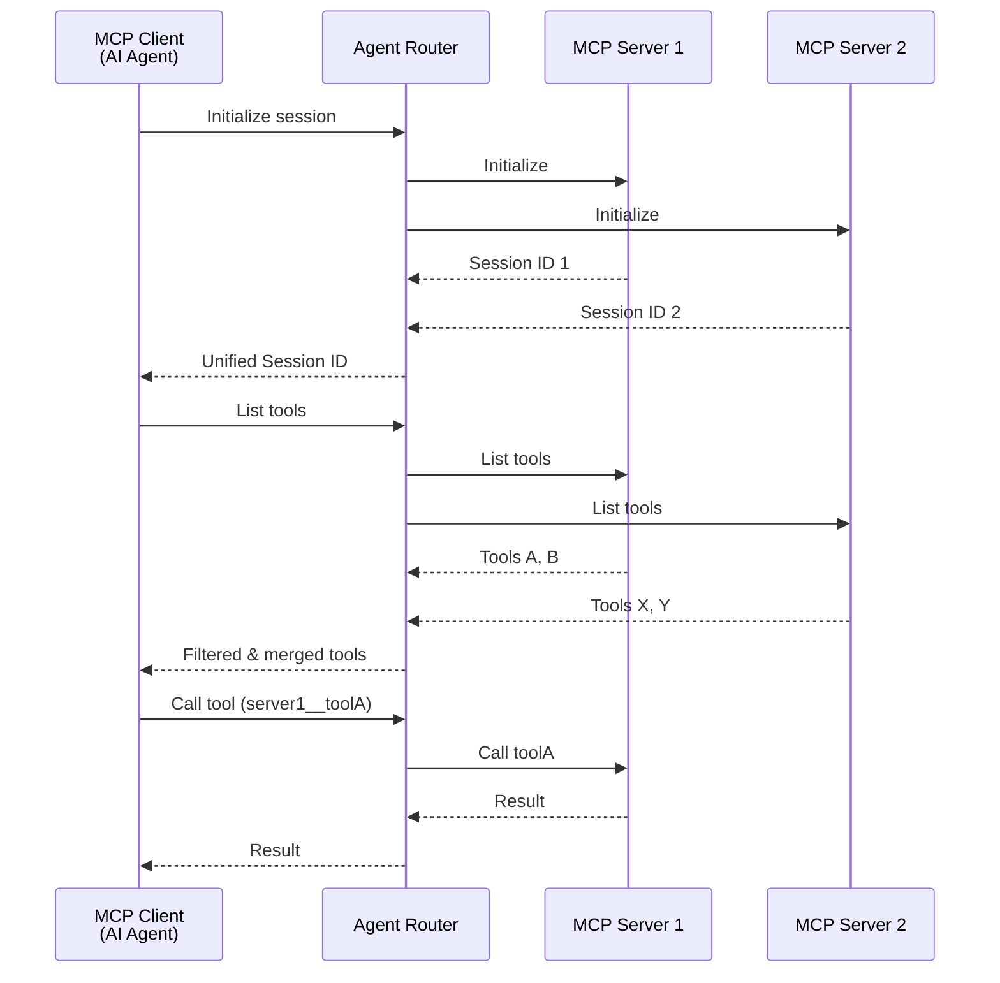
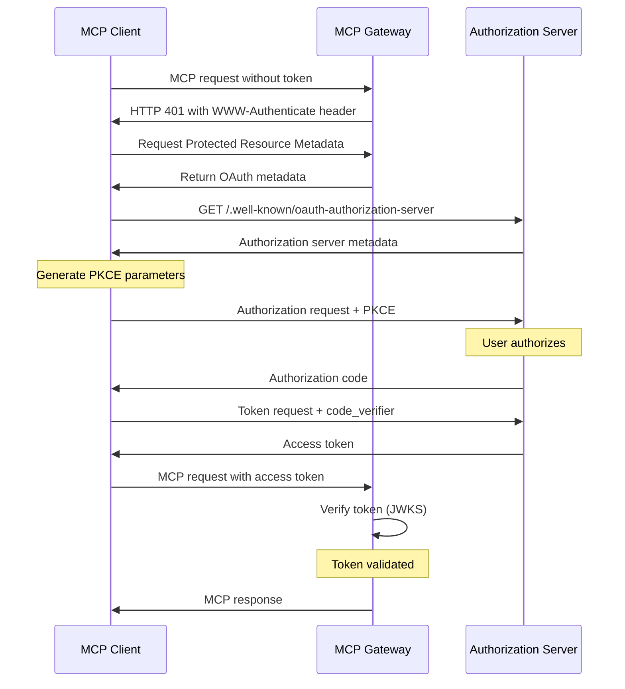

Agent Router provides first-class support for [Model Context Protocol](https://modelcontextprotocol.io/) (MCP), enabling AI agents to securely connect to external tools and data sources.

This guide provides an overview of the MCP Gateway capabilities and how to configure routing to MCP servers using the `MCPRoute` API.

## Overview

Agent Router's MCP support allows you to:

- **Aggregate multiple MCP servers** into a single unified endpoint
- **Apply security policies** including OAuth authentication, fine-grained access control over the tool access, and upstream API key injection
- **Filter tools** to control which capabilities are exposed to clients
- **Leverage Envoy's networking** for load balancing, rate limiting, circuit breaking, and observability

The MCP Gateway acts as a transparent proxy between MCP clients (AI agents like Claude, Goose, etc.) and backend MCP servers, providing the same production-grade features available for LLM traffic.

## Key Features

| Feature                                | Description                                                                                                                                                                                                                                                         |
| -------------------------------------- | ------------------------------------------------------------------------------------------------------------------------------------------------------------------------------------------------------------------------------------------------------------------- |
| **Streamable HTTP Transport**          | Full support for MCP's streamable HTTP transport, aligning with the [June 2025 MCP spec](https://modelcontextprotocol.io/specification/2025-06-18).<br/>Efficient handling of stateful sessions and multi-part JSON-RPC messaging over persistent HTTP connections. |
| **Fine-Grained Authorization**         | Native enforcement of [OAuth authentication flows](https://modelcontextprotocol.io/specification/2025-11-25/basic/authorization).<br/>Implement granular access control using JWT claims, scopes, and CEL expressions.                                              |
| **Server Multiplexing & Tool Routing** | Route tool calls to the right MCP backends, aggregating and filtering available tools based on gateway policy.<br/>Dynamically merge streaming notifications from multiple MCP servers into a unified interface.                                                    |
| **Upstream Authentication**            | Built-in upstream authentication primitives to securely connect to external MCP servers using API keys and header injection.                                                                                                                                        |
| **Full MCP Spec Coverage**             | Complete [June 2025 MCP spec](https://modelcontextprotocol.io/specification/2025-06-18) compliance, including support for tool calls, notifications, prompts, resources, and bi-directional server-to-client requests.                                              |
| **Built-in Observability**             | OpenTelemetry tracing and Prometheus metrics for all MCP requests, using the same observability stack as LLM traffic.                                                                                                                                               |

## Architecture

The MCP Gateway is implemented as a lightweight proxy component within the Agent Router sidecar, leveraging Envoy's battle-tested networking stack for all connection handling.



**Key architectural aspects:**

- **Session Management**: The gateway creates unified sessions by encoding multiple backend session IDs, handling reconnection with `Last-Event-ID` support for SSE streams.
- **Notification Handling**: Long-lived SSE streams from multiple MCP servers are merged into a single stream for clients, with proper event ID reconstruction.
- **Request Routing**: Tool names are automatically prefixed with the backend name (e.g., `github__issue_read`) to route calls to the correct upstream server.

For detailed architecture and design decisions, see the [MCP Gateway proposal](https://github.com/theagentrouter/agent-router/tree/main/docs/proposals/006-mcp-gateway).

## Trying it out

Before you begin, you'll need to complete the basic setup from the [Basic Usage](/docs/getting-started/basic-usage) guide, which includes installing Envoy Gateway and AI Gateway.

### Basic MCPRoute Configuration

The following example demonstrates a basic `MCPRoute` that proxies the GitHub MCP server:

```yaml
apiVersion: aigateway.envoyproxy.io/v1beta1
kind: MCPRoute
metadata:
  name: mcp-route
  namespace: default
spec:
  parentRefs:
    - name: aigw-run
      kind: Gateway
      group: gateway.networking.k8s.io
  path: "/mcp" # Clients connect to http://gateway-address/mcp
  backendRefs:
    - name: github
      kind: Backend
      group: gateway.envoyproxy.io
      path: "/mcp/x/issues/readonly"
      securityPolicy:
        apiKey:
          secretRef:
            name: github-token
---
apiVersion: gateway.envoyproxy.io/v1alpha1
kind: Backend
metadata:
  name: github
  namespace: default
spec:
  endpoints:
    - fqdn:
        hostname: api.githubcopilot.com
        port: 443
---
apiVersion: v1
kind: Secret
metadata:
  name: github-token
  namespace: default
type: Opaque
stringData:
  apiKey: ghp_your_token_here
```

Apply this configuration:

```shell
kubectl apply -f mcp-route.yaml
```

Now clients can connect to `http://<gateway-address>/mcp` and access GitHub tools.

### Tool Filtering

Control which tools are exposed using the `toolSelector` field. You can use exact matches or regular expressions:

```yaml
apiVersion: aigateway.envoyproxy.io/v1beta1
kind: MCPRoute
metadata:
  name: mcp-route
  namespace: default
spec:
  parentRefs:
    - name: aigw-run
      kind: Gateway
      group: gateway.networking.k8s.io
  backendRefs:
    # GitHub: only expose issue-related tools
    - name: github
      kind: Backend
      group: gateway.envoyproxy.io
      path: "/mcp/x/issues/readonly"
      toolSelector:
        includeRegex:
          - .*issues?.* # Matches issue_read, list_issues, etc.
      securityPolicy:
        apiKey:
          secretRef:
            name: github-token

    # Context7: expose specific tools by exact name
    - name: context7
      kind: Backend
      group: gateway.envoyproxy.io
      path: "/mcp"
      toolSelector:
        include:
          - resolve-library-id
          - query-docs
```

:::note
The `toolSelector` field requires exactly one of `include` or `includeRegex` to be specified. If not specified, all tools from the MCP server are exposed.
:::

### Server Multiplexing

The gateway automatically aggregates tools from multiple MCP servers into a single unified interface:

```yaml
apiVersion: aigateway.envoyproxy.io/v1beta1
kind: MCPRoute
metadata:
  name: mcp-unified
  namespace: default
spec:
  parentRefs:
    - name: aigw-run
      kind: Gateway
      group: gateway.networking.k8s.io
  path: "/mcp"
  backendRefs:
    - name: github
      kind: Backend
      group: gateway.envoyproxy.io
      path: "/mcp/x/issues/readonly"
      securityPolicy:
        apiKey:
          secretRef:
            name: github-token
    - name: context7
      kind: Backend
      group: gateway.envoyproxy.io
      path: "/mcp"
```

Clients will see all tools with prefixed names:

- `github__issue_read`
- `github__list_issues`
- `context7__resolve-library-id`
- `context7__query-docs`

### Header Forwarding

Forward HTTP headers from the client request to specific backend MCP servers. This enables per-user authentication passthrough (e.g., personal access tokens) without requiring OAuth:

```yaml
apiVersion: aigateway.envoyproxy.io/v1beta1
kind: MCPRoute
metadata:
  name: mcp-unified
  namespace: default
spec:
  parentRefs:
    - name: aigw-run
      kind: Gateway
      group: gateway.networking.k8s.io
  path: "/mcp"
  backendRefs:
    - name: atlassian
      kind: Backend
      group: gateway.envoyproxy.io
      path: "/mcp"
      forwardHeaders:
        - name: X-Atlassian-Jira-Personal-Token
        - name: X-Atlassian-Jira-Url
        - name: Authorization
          backendHeader: X-Original-Auth # optional: rename the header
    - name: github
      kind: Backend
      group: gateway.envoyproxy.io
      path: "/mcp"
      securityPolicy:
        apiKey:
          secretRef:
            name: github-token
```

Each `forwardHeaders` entry specifies:

- `name` (required): The header to extract from the incoming client request.
- `backendHeader` (optional): A different header name to use when forwarding to the backend. If omitted, the original header name is used.

Header **values** are forwarded verbatim. The gateway does not add an auth scheme such as `Bearer `.

Headers are scoped per-backend — during fan-out operations like `tools/list`, only the backends with explicit `forwardHeaders` configuration receive the forwarded headers. Other backends in the same route are unaffected.

To keep a default least-privilege service-account token on a backend while letting callers override it with a personal access token, set `securityPolicy.apiKey.injectionPolicy: IfNotPresent` and map the client token onto the same header with `forwardHeaders`. When the client omits that header, the gateway injects the configured API key (and prefixes it with `Bearer ` when the target is `Authorization`). When the client sends it, the forwarded value is preserved as-is. The default is `injectionPolicy: Always`, which always injects the configured credential.

```yaml
apiVersion: aigateway.envoyproxy.io/v1beta1
kind: MCPRoute
metadata:
  name: mcp-unified
  namespace: default
spec:
  parentRefs:
    - name: aigw-run
      kind: Gateway
      group: gateway.networking.k8s.io
  backendRefs:
    - name: github
      kind: Backend
      group: gateway.envoyproxy.io
      securityPolicy:
        apiKey:
          secretRef:
            name: github-sa-token # default least-privilege service account
          injectionPolicy: IfNotPresent
      forwardHeaders:
        - name: X-GitHub-PAT
          backendHeader: Authorization
```

For that example, send the full header value the backend expects, including the scheme:

```
X-GitHub-PAT: Bearer ghp_...
```

A raw token (`X-GitHub-PAT: ghp_...`) is copied onto `Authorization` unchanged, so the backend typically rejects it. Omit `X-GitHub-PAT` to use the injected service-account key instead.

`injectionPolicy` applies only to header injection. Do not combine `injectionPolicy: IfNotPresent` with `queryParam`. If the MCPRoute itself uses OAuth or API-key client authentication, do not forward inbound `Authorization` (that is the gateway token). Use a dedicated client header and `backendHeader` to map it onto the backend credential header.

### OAuth Authentication

Protect your MCP Gateway with OAuth authentication following the [MCP Authorization specification](https://modelcontextprotocol.io/specification/2025-06-18/basic/authorization):

```yaml
apiVersion: aigateway.envoyproxy.io/v1beta1
kind: MCPRoute
metadata:
  name: mcp-route
  namespace: default
spec:
  parentRefs:
    - name: aigw-run
      kind: Gateway
      group: gateway.networking.k8s.io
  backendRefs:
    - name: github
      kind: Backend
      group: gateway.envoyproxy.io
      path: "/mcp/readonly"
  securityPolicy:
    oauth:
      issuer: "https://keycloak.example.com/realms/master"
      audiences:
        - "https://api.example.com/mcp"
      protectedResourceMetadata:
        scopesSupported:
          - "profile"
          - "email"
```

#### The resource identifier

RFC 9728 requires the gateway to advertise a `resource` identifier — the canonical URL of the
protected MCP endpoint — both in the Protected Resource Metadata document and in the
`WWW-Authenticate` challenges it returns. Clients compare that value against the URL they used,
so it has to match exactly, down to the scheme and port.

By default the gateway derives it per request, from the scheme (the forwarded protocol), the
authority (host and port) and the path the client actually used. One MCPRoute therefore serves
the correct identifier on every hostname and port it is reachable on, with nothing to configure
and nothing to keep in sync when the gateway moves.

Set `protectedResourceMetadata.resource` explicitly only when the externally visible URL cannot
be recovered from the request — for example behind a CDN or reverse proxy that rewrites the
authority without setting the forwarded headers. An explicit value always wins:

```yaml
protectedResourceMetadata:
  resource: "https://api.example.com/mcp"
```

Because the identifier is resolved per request, the gateway trusts the `Host` and
`X-Forwarded-Proto` headers it receives. Envoy overwrites `X-Forwarded-Proto` from the actual
downstream connection, but it does **not** sanitize `Host` — it forwards the authority the
client sent. A listener with no `hostname` accepts any authority, so on such a listener the
advertised identifier reflects whatever the client asked for. Set a `hostname` on the listener,
or `hostnames` on the MCPRoute, if you need the gateway to only answer for names you have
declared.

That constrains the host name, not the whole authority. Envoy ignores the port when matching a
request against a listener but still forwards the `Host` header intact, so a request for
`api.example.com:31337` reaches a listener declared for `api.example.com` and the port it
carries ends up in the advertised identifier. A wildcard `hostname` such as `*.example.com`
likewise admits any subdomain. Pin `protectedResourceMetadata.resource` if the identifier has
to be exact.

#### Audience validation

`audiences` is matched against the `aud` claim of the incoming token, and it is configured
statically. A client that follows RFC 8707 sends the advertised `resource` as the `resource`
parameter when requesting a token, and the authorization server binds `aud` to that value — so
a derived identifier and a static `audiences` list have to agree.

Concretely: if the gateway is reached at `http://127.0.0.1:1975` the derived identifier is
`http://127.0.0.1:1975/mcp`, a token minted for it carries that `aud`, and validation against
`audiences: ["https://api.example.com/mcp"]` fails.

So when `audiences` is set and `resource` is derived, list every address the route is reachable
on, or pin `resource` instead. This only applies when both conditions hold: an authorization
server that honours the `resource` parameter, and a non-empty `audiences`.

The OAuth flow follows the MCP specification's authorization code flow with PKCE:



### Authorization Policies

Agent Router supports fine-grained access control over tool access using a combination of:

- **JWT Scopes & Claims**: Validate standard OAuth2 scopes and custom claims
- **Tool Selection**: Restrict access to specific tools
- **CEL Expressions**: Flexible, advanced matching using Common Expression Language (CEL)

#### Configuration Structure

Authorization is configured in the `MCPRoute` resource under `spec.securityPolicy.authorization`.

```yaml
spec:
  securityPolicy:
    authorization:
      rules:
        - source:
            jwt:
              scopes: ["read"]
          target:
            tools:
              - backend: "github"
                tool: "list_issues"
```

#### Rule Evaluation

Rules are evaluated in order. The first rule that matches the request (Target, Source, and CEL) determines the action (Allow/Deny). If no rules match, the `defaultAction` is applied.

#### Matchers

| Matcher    | Description                                                                                                                                                         |
| ---------- | ------------------------------------------------------------------------------------------------------------------------------------------------------------------- |
| **Target** | Matches specific tools. Can filter by `backend` and `tool` name.                                                                                                    |
| **Source** | Matches JWT properties. <br/>`scopes`: List of required scopes (all must be present).<br/>`claims`: Key-value pairs. Arrays in claims match if _any_ value matches. |
| **CEL**    | Advanced expression evaluated against the request context.                                                                                                          |

#### CEL Context

The following variables are available in CEL expressions:

| Variable              | Description                                    |
| --------------------- | ---------------------------------------------- |
| `request.method`      | HTTP method (e.g., "POST")                     |
| `request.host`        | Host header value                              |
| `request.path`        | URL path                                       |
| `request.headers`     | Map of headers (lowercased keys, single value) |
| `request.auth.jwt`    | Parsed JWT `{claims: ..., scopes: [...]}`      |
| `request.mcp.method`  | MCP JSON-RPC method (e.g., "tools/call")       |
| `request.mcp.backend` | Target backend name                            |
| `request.mcp.tool`    | Target tool name (for tool calls)              |
| `request.mcp.params`  | Parsed JSON-RPC parameters                     |

#### Examples

**Comprehensive Policy Example**

This example demonstrates various matching strategies including token scopes, claims, tool targeting, and CEL expressions.

```yaml
authorization:
  rules:
    - source:
        jwt:
          scopes:
            - echo
      target:
        tools:
          - backend: mcp-backend
            tool: echo
      cel: request.mcp.params.arguments.text.matches("^Hello, .*!$") && request.headers["x-tenant-id"] == "t-123"
    - source:
        jwt:
          scopes:
            - sum
          claims:
            - name: tenant
              valueType: String
              values:
                - acme
                - globex
            - name: org.departments
              valueType: StringArray
              values:
                - engineering
                - development
      target:
        tools:
          - backend: mcp-backend
            tool: sum
```

## See Also

- [MCP Gateway Proposal](https://github.com/theagentrouter/agent-router/tree/main/docs/proposals/006-mcp-gateway) - Detailed architecture and design decisions
- [MCP Specification](https://modelcontextprotocol.io/specification/2025-06-18) - Official Model Context Protocol documentation
- [MCP Example](https://github.com/theagentrouter/agent-router/tree/main/examples/mcp) - Complete working example
- [CLI MCP Configuration](/docs/cli/aigwrun#mcp-configuration) - Using MCP with `aigw run` standalone mode
